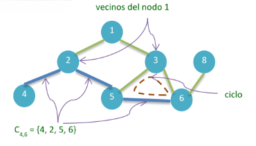
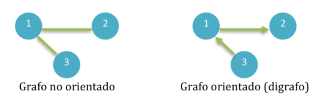
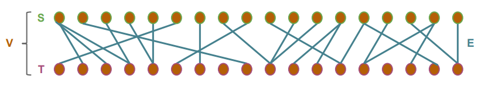
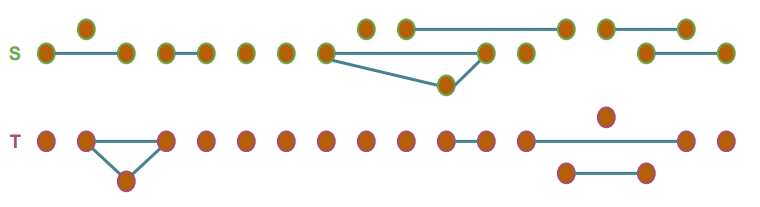
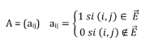

# Grafos

## El concepto de grafos
Recordando [cómo relacionamos las estructuras lineales con las jerárquicas](../03_arboles/intro_arboles.md#el-concepto-de-árbol), podemos pensar a una estructura arbórea como una generalización de una estructura lineal: en las listas cada nodo tiene un único sucesor, mientras que los árboles incorporan la capacidad de tener múltiples sucesores (descendientes directos). Continuamos con esta misma idea para introducir el concepto de **Grafo**, el cual puede pensarse como **una extensión del árbol**, incorporando la posibilidad de **tener más de un predecesor**, en contraste con la restricción de estos últimos respecto a que sólo pueden tener un nodo antecesor directo.

Esta comparación es muy importante para determinar el tipo de estructura con el cual deseamos modelar una solución, porque **los árboles son esencialmente grafos**. Existirán problemas donde la restricción de **un único nodo antecesor directo** (exceptuando la raíz, que no tiene antecesor) que aplica sobre los árboles, resulta de utilidad, mientras que en otras situaciones necesitaremos estructuras conectivas más flexibles, con menos restricciones. Aquí es donde podemos apoyarnos en los grafos.

> Un **grafo** es una estructura que permite **representar relaciones** entre elementos.

Si bien existen tipos de grafos (_hipergrafos_) que pueden modelar relaciones n-arias, nos centraremos en los grafos donde las conexiones sólo relacionan uno o dos nodos.

Por supuesto que una **lista o un árbol** también representan relaciones entre elementos. En el primer caso pueden representar una sucesión de elementos con cierto orden, en el segundo una relación de niveles jerárquicos. Es por ello que ambas estructuras son también grafos, sólo que **son especializaciones de grafos con ciertas restricciones**. 

> Una lista es lo que se denomina **árbol degenerado**: cada nodo del árbol tiene como máximo un nodo descendiente directo. Así que la lista sería una especialización de árbol, por ende, una especialización de grafo.

Entonces, el concepto de grafo es lo suficientemente abstracto y flexible para diseñar soluciones que requieran modelar relaciones entre elementos. Veamos algunos ejemplos.

### Algunas aplicaciones

- **Redes Sociales**:
Los usuarixs pueden ser representados como nodos y las _amistades_ como aristas. Este modelo ayuda a estudiar la propagación de información, encontrar comunidades, influencers, etc.

- **Mapas y Rutas de Transporte**:
Las ciudades o estaciones se representan como nodos y las calles o rutas como aristas. Este modelo se usa en sistemas de navegación, optimización de rutas, análisis de tráfico, etc.

- **Redes de Comunicación**:
Los dispositivos de red (switches, routers) son nodos y las conexiones entre ellos son aristas. Ayuda en el diseño y análisis de la eficiencia de las redes de comunicación, monitoreo, detección de fallas, etc.

- **Análisis de Dependencias**:
En desarrollo de software, los módulos o paquetes se pueden representar como nodos y las dependencias entre ellos como aristas. Esto ayuda a gestionar y optimizar la construcción de proyectos grandes, automatizar los procesos de _building_, _deploy_, _testing_, etc.

- **Flujos de actividades**:
En la ejecución de tareas, las actividades se pueden representar como nodos y las dependencias entre ellas como las aristas. Es útil por ejemplo en la gestión de proyectos para desplegar recursos necesarios para completar las actividades en el orden requerido, cálculo del camino crítico (CPM), realizar estimaciones de tiempo y recursos, etc.

## Definiciones

Formalicemos ahora algunas definiciones sobre los grafos.

> Un grafo `G` es un conjunto finito de nodos o vértices `(v1, v2, …, vn)` que pueden estar conectados mediante arcos o aristas `(e1, e2, …, em)`.

> `G = (V, E)` 
> - `V`: conjunto de vértices
> - `E`: conjunto de aristas (`E ⊆ V x V`)

Una **arista** se representa mediante un par ordenado que contiene vértice origen `(vo)` y destino `(vd)` de la conexión: `(vo, vd)`.

Usualmente, los nodos suelen representar alguna entidad a modelar, mientras que las aristas representan relaciones entre dichas entidades, pero puede suceder que las aristas sean también otras entidades que permitan conectar a los nodos.

### Diagrama de un grafo


### Grado
El **grado de un nodo `n`** se refiere a la cantidad de **aristas que convergen** en él: `d(n, G)`.

En el [ejemplo](#diagrama-de-un-grafo):
- `d(1, G) = 2`
- `d(2, G) = 3`
- `d(3, G) = 3`
- `d(4, G) = 1`
- `d(5, G) = 3`
- `d(6, G) = 3`
- `d(8, G) = 1`

> En [digrafos](#grafo-orientado-o-dirigido) se distinguen los grados de entrada (aristas que llegan al nodo) y de salida (aristas que salen del nodo).

### Vecinos
Los **vecinos de un nodo `n`** son el conjunto de nodos adyacentes al él.

`𝑣𝑒𝑐𝑖𝑛𝑜𝑠(𝑛) = { 𝑥 / (𝑛, 𝑥) ∈ 𝐸 }`

En el [ejemplo](#diagrama-de-un-grafo):
- `𝑣𝑒𝑐𝑖𝑛𝑜𝑠(1) = {2, 3}`
- `𝑣𝑒𝑐𝑖𝑛𝑜𝑠(2) = {1, 4, 5}`
- `𝑣𝑒𝑐𝑖𝑛𝑜𝑠(3) = {1, 5, 6}`
- `𝑣𝑒𝑐𝑖𝑛𝑜𝑠(4) = {2}`
- `𝑣𝑒𝑐𝑖𝑛𝑜𝑠(5) = {2, 3, 6}`
- `𝑣𝑒𝑐𝑖𝑛𝑜𝑠(6) = {3, 5, 8}`
- `𝑣𝑒𝑐𝑖𝑛𝑜𝑠(8) = {6}`

### Camino
Un **camino de `n` a `m`** es una sucesión de aristas desde un nodo `n` a un nodo `m`.

`𝐶𝑛,𝑚 = 𝑛, 𝑥, 𝑦, … , 𝑚`
- donde `(n,x), (x,y), …` son vecinos o adyacentes.

> **Longitud de un camino**: cantidad de aristas de un camino.

> **Circuito o ciclo**: camino de longitud mayor a 1 que comienza y termina en el mismo nodo.

## Tipos de grafos
Vamos a introducir algunas definiciones básicas de distintos tipos de grafos, determinados a partir de **restricciones o características que pueden tener**. No son necesariamente excluyentes entre sí, podemos construir grafos que cumplan con más de una condición, lo cual permitirá una gran combinación de estructuras a modelar.

### Grafo Orientado o Dirigido
Un grafo **no dirgido** representa **relaciones simétricas** entre sus vértices. Una arista que conecta a los vértices `u` y `v`, indica que conecta de la misma forma al vértice `v` con `u`, no existe concepto de dirección en la relación. En cambio, cuando la relación es asimétrica, esto es, una arista conecta a un vértice `u` con `v`, pero no al revés, diremos que es un **grafo orientado o dirigido (digrafo)**. La representación gráfica se realiza modelando las aristas con flechas que indican la dirección de la relación.



En el caso del digrafo de la imagen, el nodo 1 se conecta o relaciona con el nodo 2, pero el nodo 2 no se relaciona con el nodo 1. Existe una navegabilidad explícita que limita el grado de conexión entre ambos nodos. Las aristas correspondientes a dicho grafo son: `E = {(1,2); (3,1)}`.

> Un grafo es orientado o dirigido si sus aristas tienen una dirección que restringe la
conexión entre los nodos.

### Grafo Conexo
Un grafo es **conexo** si para cualquier par de nodos `u`, `v` existe al menos una sucesión de nodos adyacentes desde `u` a `v`, es decir, existe al menos un camino entre cualquier par de nodos. En el caso de grafos dirigidos, contemplaremos los _semicaminos_, aquellos que consideran a las aristas como no dirigidas.

> Si un grafo es inconexo, podremos distinguir que se construye a partir de subgrafos conexos denominados también **componentes conexos**.

### Grafo regular
Un grafo donde **todos sus vértices tienen el mismo grado**, se lo denomina **grafo regular**. Si el grado de los vértices es `k`, diremos que el grafo es `k-regular`.

> Un grafo con `V` vértices, simple y `(V-1)-regular` se dice que es un **grafo completo**. Cada par de vértices está conectado por una arista.

### Pseudografo
Cuando una arista conecta a un nodo con sí mismo, se denomina **lazo o bucle**. Representa una **relación reflexiva** del nodo y se la identifica con el par ordenado `(u, u)`, siendo el lazo sobre el nodo `u`. Un **pseudografo** es aquel que **contiene al menos un bucle o lazo**.

> Cuando un grafo **no tiene bucles o aristas paralelas** (aquellas que conectan a los mismos vértices), se lo denomina **grafo simple**.

### Multigrafo
Existe la posibilidad de representar múltiples relaciones entre dos vértices, es decir, tener múltiples aristas entre ellos. Por ejemplo, en una red social laboral pueden existir distintos tipos de relaciones a modelar, podríamos necesitar representar tanto el grado de amistad entre personas, como así también la pertenencia a grupo de trabajo. Entonces, si una persona A es amiga de otra persona B y ambas personas pertenecen a un mismo equipo laboral, existirían 2 conexiones entre los nodos que las representan. Comenzamos a ver que las aristas no son simples conexiones, sino que pueden representar una abstracción más compleja como el tipo de relación entre personas.

> Un **multigrafo** es aquel que permite conexiones múltiples entre mismo par de nodos.

### Grafo bipartito
Podemos determinar la pertenencia de un nodo a un cierto grupo a través del patrón de conexión del grafo. Cuando observamos **dos particiones de nodos, donde cada nodo de
una partición no se relaciona con otro nodo de la misma**, sino que sólo se relaciona con nodos de la otra partición, estaremos hablando de un **grafo bipartito**.

> En un **grafo bipartito** `G(V,E)` los nodos se distribuyen en dos particiones (`V = S u T`) y los nodos de una partición sólo pueden relacionarse con nodos de la otra. Cada arista en `E` tiene un nodo en `S` y el otro en `T`.

El siguiente es un grafo bipartito:



La relación implícita entre los nodos de cada partición (aquellos que se conectan con el mismo nodo de la otra) se puede graficar así:



Por ejemplo, si modelamos la relación de actores y actrices con las películas donde actuaron, tendremos dos clases o grupos donde los nodos de un grupo (actores/actrices) sólo se conectan con nodos del otro grupo (películas).

### Grafo Ponderado
La definición de **grafo ponderado o pesado** se centra en que **cada arista tiene un peso o costo asociado**, algo que resulta útil para aplicar en el cálculo de costos de caminos entre distintos nodos.

> En un grafo ponderado o pesado las aristas tienen un peso o valor numérico asociado.

A veces es útil modelar un grafo ponderado donde existan no sólo pesos positivos, sino también pesos negativos. Se podrían representar como una ganancia en la relación, en lugar de un costo.

> Si se decide utilizar pesos negativos para ponderar aristas debemos tenerlo presente para saber qué tipo de algoritmos se pueden aplicar luego para buscar caminos mínimos.

#### Ciclo negativo
En un grafo ponderado puede suceder que exista **un ciclo en el cual la suma de sus aristas adyacentes que lo conforman sea menor a 0**, al cual se lo denomina **ciclo negativo**. La detección de este tipo de ciclos es muy importante ya que, según el algoritmo que utilicemos para buscar caminos mínimos, puede resultar que genere errores en tiempo de ejecución si no se contempla este detalle.

## Formas de representación

Introduciremos algunas de las formas más comunes de representar grafos y propondremos cómo podríamos implementarlos en Python. Si bien trabajaremos con el concepto de grafo abstracto o genérico (paramétrico), en la práctica seguramente modelaremos las soluciones construyendo las abstracciones puntuales, sin utilizar una estructura genérica del estilo `Grafo[T]` como hacíamos con las listas u otros tipos abstractos de datos clásicos.

Contemplando esto último, las operaciones básicas de un grafo siempre serán dependientes del problema a resolver. De todas formas veremos algunas operaciones clásicas que seguramente sean necesarias para construir y consumir la estructura de cualquier grafo, junto con algunas consideraciones comunes.

| Operación | Detalles |
|-----------|----------|
| Crear la estructura | Inicialización de atributos según representación seleccionada. Es posible considerar la abstracción de un grafo vacío. |
| Agregar nodo | Verificar si el nodo no existía previamente en el grafo (id repetido). |
| Agregar arista | Conectar dos nodos. Verificar si ambos nodos conectados existen en el grafo y si la arista no existía (si no es multigrafo). |
| Eliminar nodo | Verificar nodo existente y que no tenga aristas asociadas, luego eliminarlo. |
| Eliminar arista | Verificar arista existente, luego eliminarla. |
| Existe conexión | Devuelve `True` si dos nodos están conectados. |
| Ver conexión | Devuelve la etiqueta de la arista que conecta dos nodos |
| Es vecino de `v` | Devuelve `True` si un nodo `u` es vecino de un nodo `v` |
| Vecinos de `v` | Devolver todos los vecinos de un nodo `v` |

### Conjuntos de nodos y aristas
Una de las formas más simple de representar grafos es a través de dos conjuntos Tendremos así **un conjunto de nodos o vértices** y **un segundo conjunto será para almacenar los pares ordenados de las aristas**, probablemente apoyándonos en un tipo de dato que represente una tupla como en Python lo hace `tuple`, una clase específica que represente la relación, o un simple registro de dos campos si estamos en un lenguaje no orientado a objetos.

En el [ejemplo](#diagrama-de-un-grafo):
- Conjunto de nodos: `V = {1, 2, 3, 4, 5, 6, 8}`
- Conjunto de aristas: `E = {(1,2), (1,3), (2,4), (2,5), (3,5), (3,6), (5,6), (6,8)}`

> En nuestro ejemplo el grafo es no dirigido, por lo cual las aristas pueden representarse **con un único par ordenado** (enlace simple), o bien con dos pares ordenados **incluyendo origen y destino de la conexión en ambos sentidos** (enlace doble). Por ejemplo, la conexión entre los nodos 1 y 3 sería representada con enlace doble con dos pares ordenados (1,3) y (3,1). La decisión de la forma de enlace a usar dependerá de cómo se consumirá la estructura según el problema a resolver. 
> - Los enlaces simples son sencillos de mantener porque sólo se debe insertar o eliminar un elemento del conjunto de aristas, pero probablemente la búsqueda de vecinos de un nodo sea más costosa. 
> - Con un enlace doble las aristas podrían estar ordenadas por el nodo origen y así la búsqueda sería más performante, pero duplicaría las operaciones cuando modificamos conexiones.

Veamos una forma de implementar este tipo de estructura en Python:

```python
from typing import Generic, TypeVar

T = TypeVar('T')

class Nodo(Generic[T]):
    def __init__(self, dato: T) -> None:
        self.dato = dato

class Grafo(Generic[T]):
    def __init__(self) -> None:
        self.nodos: set[Nodo[T]] = set()
        self.aristas: set[tuple[Nodo[T], Nodo[T]]] = set()
```
El uso de `set` en lugar de otro tipo de colección como `list` dependerá de cuestiones de rendimiento propios de la solución particular, cómo se implementan sus operaciones y cómo se consume usualmente nuestro grafo. Siempre debemos recordar que disponemos de distintos tipos de estructuras que serán adecuadas para ciertas situaciones, **no existe una única solución general para modelar**. De la misma forma, si necesitáramos modelar información adicional en las aristas, no podríamos utilizar el tipo `tuple`, sino una clase nueva que defina la información en sus atributos, junto con los nodos conectados.

Por ejemplo, si deseamos modelar un multigrafo sin información adicional en las aristas, similar al ejemplo provisto, no podríamos utilizar un `set` para el conjunto de aristas. El tipo `set` no permite insertar un mismo elemento más de una vez, por lo cual la cantidad máxima de conexiones posibles entre dos nodos estará acotada a 1. Para modelar un multigrafo con aristas de tipo `tuple[Nodo[T], Nodo[T]]`, deberíamos optar por una estructura que acepte repetidos como `list`.

Esta versión paramétrica sirve para ejemplificar la estructura, pero veamos un caso práctico donde la adaptaremos para modelar las diferentes rutas entre ciudades.

```python
class Ciudad:
    def __init__(self, nombre: str, poblacion: int) -> None:
        self.nombre = nombre
        self.poblacion = poblacion

class Ruta:
    def __init__(self, origen: Ciudad, destino: Ciudad, distancia: int) -> None:
        self.origen = origen
        self.destino = destino
        self.distancia = distancia

class Region:
    def __init__(self) -> None:
        self.ciudades: set[Ciudad] = set()
        self.rutas: set[Ruta] = set()
```
En este modelo estamos incorporando el concepto de **peso o costo** de las aristas, el cual representa la **distancia entre ciudades** en cierta ruta, generando un **grafo ponderado**. Si las rutas fueran de dirección de circulación única, estaríamos ante un caso de grafo dirigido, donde la conexión es únicamente posible desde la ciudad origen a la destino. Esta decisión no la contemplamos en esta estructura sino que eventualmente se definirá a partir de la operación `vecinos`, o mejor dicho, `ciudades_conectadas`.

> Este tipo de representación es **fácil de implementar** y útil para almacenar estructuras **con alto grado de conectividad** (gran cantidad de aristas), en cambio, en el acceso y la navegación del grafo, es posible que no sea la solución más adecuada.

### Lista de Adyacencias
Una estrategia interesante para representar grafos que no tengan un alto grado de conectividad (ralos o _sparse) es mediante el uso de una **lista de adyacencias**. El grafo tendrá una lista de nodos, similar al conjunto de vértices del caso anterior, y cada nodo tendrá asociado también su lista de nodos adyacentes (nodos vecinos).

En el [ejemplo](#diagrama-de-un-grafo):
| Nodo | Adyacentes |
| ---- | ---------- |
| 1 | 2, 3 |
| 2 | 1, 4, 5 |
| 3 | 1, 5, 6 |
| 4 | 2 |
| 5 | 2, 3, 6 |
| 6 | 3, 5, 8 |
| 8 | 6 |

> El debate de qué significa el grado de baja conectividad no está claro y varía según cada autor o los problemas a modelar. Una **heurística para utilizar esta forma de representación** sería que la cantidad de aristas no sea mayor al cuadrado de la cantidad de nodos: `#E < #V^2`.

Una forma sencilla de implementarlo en Python sería así:

```python
from typing import Generic, TypeVar

T = TypeVar('T')

class Nodo(Generic[T]):
    def __init__(self, dato: T) -> None:
        self.dato = dato
        self.vecinos: set[Nodo[T]] = set()
        
class Grafo(Generic[T]):
    def __init__(self) -> None:
        self.nodos: set[Nodo[T]] = set()
```
Ahora la conexión entre los nodos, dada por el atributo _vecinos_, se encuentra implementada dentro de la clase `Nodo`. Cada objeto de `Nodo` tendrá cargado en ese atributo a sus nodos adyacentes. Una alternativa que favorece la **reutilización** de la abstracción de los nodos sería implementando las adyacencias directamente en la clase `Grafo`.

```python
class Nodo(Generic[T]):
    def __init__(self, dato: T) -> None:
        self.dato = dato
        
class Grafo(Generic[T]):
    def __init__(self) -> None:
        self.nodos: dict[Nodo[T], set[Nodo[T]]] = {}
```
En esta versión, nos apoyamos en el tipo `dict` que nos permite indexar al conjunto de nodos, quienes conforman las _claves_ del mapa. El valor asociado a cada objeto de nodo será su conjunto o lista de adyacentes. Así logramos que la clase `Nodo` sea reutilizable por fuera del problema del grafo.

> En este tipo de representación, a diferencia del uso de conjunto de nodos y aristas, **la búsqueda de nodos vecinos es realmente rápida**, simplemente se devuelven la lista de adyacentes que tiene referenciado el nodo. Una posible desventaja de este tipo de representaciones es el costo asociado al mantenimiento de las adyacencias, más si se trata de un grafo con muchas conexiones.

#### Ejercicio: Ponderado con lista de adyacencias
Adaptar la implementación del grafo representado con lista de adyacencias de forma que permita modelar un grafo ponderado.

### Matriz de Adyacencias
La representación con matrices cobra importancia cuando se estudia la estructura desde las matemáticas, permite un modelado formal y análisis de diversas propiedades a través de operaciones matriciales. En el campo de la computación es una representación útil cuando se requiere rendimiendo para consultar el estado de conexión entre dos nodos. Se sacrifica en parte flexibilidad en el crecimiento y, si tiene muchos nodos, consume una importante cantidad de memoria. Esto último se puede comparar con la decisión de utilizar un arreglo estático vs dinámico.

El grafo se representa con una **matriz cuadrada** de dimensión `V x V` donde cada índice de fila (_i_) o columna (_j_) representa a cada nodo. Este diseño resulta complejo en ciertos lenguajes para estructuras muy cambiantes, donde se inserten o eliminen nodos constantemente, pero sería también posible implementarlo sobre memoria dinámica con ciertos lenguajes. El mayor problema de esta estrategia aparece ante grafos con muchos nodos, el espacio requerido en memoria será de costo cuadrático (`V^2`).

En el caso de un **grafo no ponderado**, la definición de la matriz es la siguiente:



En el [ejemplo](#diagrama-de-un-grafo):
| | 1 | 2 | 3 | 4 | 5 | 6 | 8 |
| - | - | - | - | - | - | - | - |
| **1** | 0 | 1 | 1 | 0 | 0 | 0 | 0 |
| **2** | 1 | 0 | 0 | 1 | 1 | 0 | 0 |
| **3** | 1 | 0 | 0 | 0 | 1 | 1 | 0 |
| **4** | 0 | 1 | 0 | 0 | 0 | 0 | 0 |
| **5** | 0 | 1 | 1 | 0 | 0 | 1 | 0 |
| **6** | 0 | 0 | 1 | 0 | 1 | 0 | 1 |
| **8** | 0 | 0 | 0 | 0 | 0 | 1 | 0 |

Las celdas de la matriz representan la existencia de una conexión entre los nodos _i_, _j_. Si se trata de un grafo ponderado, se puede asignar el **peso de la arista en lugar del número 1**, pero se debe tener cuidado de cómo modelar la no conexión ya que el 0 es posible que represente una conexión de costo 0. Podríamos hacer una matriz de otro tipo de dato que no sea _Entero_.

> En **grafos no dirigidos**, la matriz de adyacencia será **simétrica**.

Esta forma de representación es adecuada para grafos con alto grado de conectividad, de lo contrario nos quedaría una matriz rala (_sparse matrix_) donde muy pocas de sus celda tendrían información relevante (la mayoría serían 0). En algunos lenguajes, cuando se trabaja con matrices ralas, internamente se implementan a través de **listas de adyacencias** para evitar consumir espacio en memoria.

Veamos cómo podríamos implementarlo en Python.

```python
from typing import Generic, TypeVar

T = TypeVar('T')

class Nodo(Generic[T]):
    def __init__(self, dato: T) -> None:
        self.dato = dato
        
class Grafo(Generic[T]):
    def __init__(self) -> None:
        self.nodos: list[Nodo[T]] = []
        self.adyacencias: list[list[int]] = []
```
La lista de `nodos` se utiliza para almacenar la información (objeto) de cada nodo, luego utilizaremos ese mismo índice para alinearlo con las filas y columnas de la matriz cargada en el atributo `adyacencias`. Por ejemplo, el primer elemento de `nodos` tiene el índice 0 en esa lista y, por ende, en la matriz `adyacencias` la fila 0 y la columna 0 representan a ese nodo. Dado que en Python las matrices se implementan con arreglos dinámicos (`list`), no tenemos el problema relacionado a estructuras muy cambiantes.

> La mayor ventaja de utilizar esta representación es la **velocidad de acceso** que nos provee la matriz indexada, donde uno puede obtener los vecinos de un nodo simplemente consultando la fila (o columna, si no es dirigido) del índice correspondiente. También es muy rápido consultar si dos nodos `u`, `v` están conectados, simplemente se consulta la matriz con los índices de ambos `adyacencias[u][v]`. Estas operaciones son muy eficientes ya que se resuelven en `O(1)`.

### Ejercicio: Operaciones básicas
Implementar las operaciones introducidas en la tabla de [formas de representación](#formas-de-representación) para cada una de las versiones de grafos genéricos propuestas.

### Ejercicio: Es completo?
Implementar una operación que permita identificar si un grafo es [completo](#grafo-regular).

### Ejercicio: Es bipartito?
Implementar una operación que permita identificar si un grafo es bipartito.


> **Lectura de interés**: 
> - [Barabási, A. L. (2016). Network science. Cambridge university press.](http://networksciencebook.com/)
